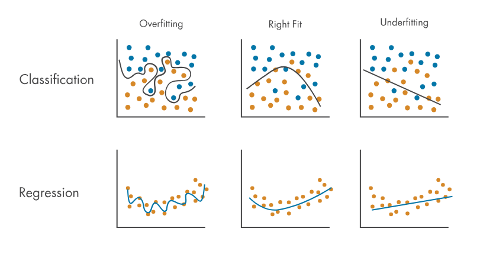



## 1. 과적합

머신러닝 과제의 폭표는 적합한 모델을 찾는 것이다. 그런데 모델이 과적합되면 어떻게 되는가?  **과적합**overfiting은 모델이 기존 관측값에는 **너무 잘** 적합하지만 미래의 새로운 관측 값에는 예측하지 못하는 것을 의미한다.
모델이 결과를 암기해버리면 과적합이 발생할 수 있다. 이는 훈련셋에서 너무 많은 정보를 추출한 탓에 모델이 훈련셋에서만 잘 작동하도록 만들었을 때 발생할 수 있는데 머신러닝에서는 이를 **편향이 낮다**low bias고 한다.

**편향**bias은 평균 예측값과 실젯값 간의 차이라고 할 수 있는데 다음과 같이 계산한다.

$$
\begin{align*}
bias[\hat{y}] &= E[\hat{y}-y]\\\\
&= E(\hat{y})-y
\end{align*}
$$
> 편향은 확률 변수가 아닌 상숫값임에 유의하자

여기서 $\hat{y}$는 예측값이다. 그러나 과적합은 새로운 데이터로 일반화하고 데이터에서 실제 패턴을 도출하는데 도움이 되지 않는다.
결과적으로 학습한 모델은 이전에 볼 수 없었던 데이터셋에서 성능이 저하하는데, 머신러닝에서는 이런 상황을 **분산이 높다**high varience고 한다. 다시 말해서, **분산**은 예측값이 얼마나 넓게 분포하는지 측정하는데 이는 곧 예측의 변동성을 나타낸다. 분산은 다음과 같이 계산한다.

$$
\begin{align*}
    Varience[\hat{y}] &= E[(\hat{y}-E[\hat{y}])^2]\\\\
             &= E[\hat{y}^2-2\hat{y}E[\hat{y}]+E[\hat{y}]^2]\\\\
             &= E[\hat{y}^2] - 2E[\hat{y}]^2 + E[\hat{y}]^2\\\\
             &= E[\hat{y}^2] - E[\hat{y}]^2
\end{align*}
$$

## 2. 과소적합

과적합과 반대되는 시나리오가 **과소적합**underfiting이다. 모델이 과소적합되면 훈련셋과 테스트셋 모두에서 잘 작동하지 않는다. 즉, 데이터의 기본 추세를 찾아내지 못하는 것이다.

모델을 훈련하는데 충분한 데이터를 사용하지 않거나 잘못된 모델을 데이터에 맞추려고 할 때에 과소적합이 발생할 수 있다. 이러한 상황을 머신러닝에서는 **편향이 높다**high bias고 한다. 그리고 훈련셋과 테스트셋에서의 성능이 모두 저하하므로 분산은 (나쁜 의미로) 일관되게 낮다.

## 3. 편향-분산 절충

과적합과 과소적합은 모두 피해야 한다. **편향**은 학습 알고리즘의 잘못된 가정에서 비롯된 오류로, 편향이 높으면 과소적합이 발생한다. **분산**은 모델의 예측이 데이터셋의 변동에 얼마나 민감한지를 측정한다.
따라서 편향이나 분산이 높아지지 않도록 해야 한다. 만약 그렇다면 항상 편향과 분산을 작게 만들 수 있을까? 가능하다면 그렇게 해야하지만 실제로는 둘이 trade-off 관계에 있어서 하나를 줄이면 다른 하나가 증가한다.
이를 소위 **편향-분산 절충**bias varience trade-off이라고 한다.

모델의 전체적인 오차를 최소화하려면 편향과 분산의 균형이 필요하다.
훈련 샘플 $x_1,x_2,...,x_n$과 목표 셋$y_1,y_2,...,y_n$이 주어졌을 때 실제 관계$y(x)$를 최대한 정확하게 추정하는 회귀함수 $\hat{y}(x)$를 찾아야 한다.
회귀모형이 얼마나 좋은지(또는 나쁜지)는 **평균제곱오차**mean squared error, MSE로 예측 오차를 측정한다

$$
MSE = E[(y(x)-\hat{y}(x))^2]
$$

여기서 $E$는 기댓값을 나타낸다. MSE는 다음 공식에서 볼 수 있듯이 유도에 따라 편향과 분산 성분으로 분해할 수 있다.
$$
\begin{align*}
    MSE &=E[(y-\hat{y})^2] \\\\
    &=E[((\hat{y}-E[\hat{y}])+(E[\hat{y}]-y))^2] \\\\
    &=E[A^2 + 2AB +B^2]\\\\
    & \text{where } A = \hat{y} - E[\hat{y}], \quad B = E[\hat{y}] - y \\\\
    & E[A^2] = E[(\hat{y} - E[\hat{y}])^2] = Varience[\hat{y}] \\\\
    & E[B^2] = E[(E[\hat{y}] - y)^2] = E[b(\hat{y})^2] = Bias[\hat{y}]^2 \\\\
    & E[2AB] = 2B\cdot E[A] = 0\\\\
    \therefore MSE  &= Bias[\hat{y}]^2 + Varience[\hat{y}]
\end{align*}
$$

편향 항은 예측 오차를 측정하고 분산 항은 예측값 $\hat{y}$이 평균 $E[\hat{y}$를 중심으로 분포하는 정도를 나타낸다. 학습 모델 $\hat{y}(x)$가 복잡할수록, 학습 샘플의 크기가 클수록 편향은 낮아진다. 그러나 이렇게 하면 증가된 데이터에 더 잘 맞도록 모델을 더 많이 변화시키게 되고, 결과적으로 분산이 커진다.

일반적으로 편향과 분산의 균형이 맞는 최적의 모델을 찾고 과적합을 줄이기 위해 regularization과 특징 축소뿐만 아니라 **교차 검증 기법**cross validation을 사용한다.
